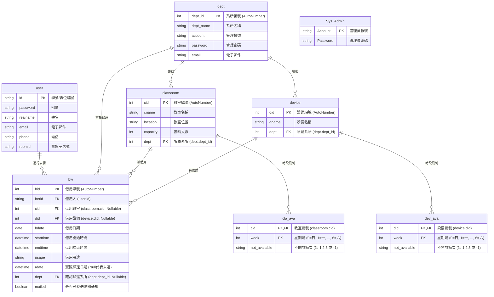

# 中山大學教室與設備借用系統 ─ 資料庫欄位與關聯說明書 (Database Schema & ERD)

本文件說明「中山大學教室與設備借用系統」之資料庫結構設計。資料庫本體為 Microsoft Access 檔案 (`AccessDB.accdb`)，位於 `DS_LAB2/App_Data/` 目錄下。

---

## 📊 1. 實體關係圖 (Entity-Relationship Diagram)

系統中的實體關聯圖 (ERD) 設計如下：

---

## 📋 2. 資料表詳細欄位設計 (Table Schemas)

### A. 一般使用者資料表 (`user`)
* **用途**：儲存註冊使用本系統的師生基本資料。

| 欄位名稱 | 資料類型 (Access) | 鍵值 (Key) | 說明 |
| :--- | :--- | :---: | :--- |
| `id` | 短文字 (Text) | **PK** | 學號或教職員職位編號 (登入帳號) |
| `password` | 短文字 (Text) | | 登入密碼 |
| `realname` | 短文字 (Text) | | 真實姓名 |
| `email` | 短文字 (Text) | | 電子郵件 (用以發送借用與逾期通知) |
| `phone` | 短文字 (Text) | | 聯絡電話 |
| `roomid` | 短文字 (Text) | | 實驗室房號 / 辦公室號碼 |

---

### B. 系所管理者資料表 (`dept`)
* **用途**：儲存各學術/行政系所管理帳號，用以審核名下教室與設備。

| 欄位名稱 | 資料類型 (Access) | 鍵值 (Key) | 說明 |
| :--- | :--- | :---: | :--- |
| `dept_id` | 自動編號 (AutoNumber) | **PK** | 系所識別編號 |
| `dept_name` | 短文字 (Text) | | 系所完整名稱 (如：資管系、電機系) |
| `account` | 短文字 (Text) | | 系所管理員登入帳號 |
| `password` | 短文字 (Text) | | 系所管理員登入密碼 |
| `email` | 短文字 (Text) | | 系所公務通知電子信箱 |

---

### C. 教室資料表 (`classroom`)
* **用途**：儲存供借用的教室之硬體資訊。

| 欄位名稱 | 資料類型 (Access) | 鍵值 (Key) | 說明 |
| :--- | :--- | :---: | :--- |
| `cid` | 自動編號 (AutoNumber) | **PK** | 教室識別編號 |
| `cname` | 短文字 (Text) | | 教室名稱 (如：B201 教室、計中一機) |
| `location` | 短文字 (Text) | | 教室實體位置 (如：管理大樓 2 樓) |
| `capacity` | 整數 (Integer) | | 教室最大容納人數 |
| `dept` | 整數 (Integer) | **FK** | 管理/所屬系所編號 (對應 `dept.dept_id`) |

---

### D. 設備資料表 (`device`)
* **用途**：儲存供借用的設備 (如投影機、麥克風、筆電) 之資訊。

| 欄位名稱 | 資料類型 (Access) | 鍵值 (Key) | 說明 |
| :--- | :--- | :---: | :--- |
| `did` | 自動編號 (AutoNumber) | **PK** | 設備識別編號 |
| `dname` | 短文字 (Text) | | 設備名稱 (如：愛普生投影機、無線麥克風 A 組) |
| `dept` | 整數 (Integer) | **FK** | 管理/所屬系所編號 (對應 `dept.dept_id`) |

---

### E. 借用紀錄表 (`bw`)
* **用途**：記錄所有的教室與設備借用申請、審核及歸還歷史狀態。

| 欄位名稱 | 資料類型 (Access) | 鍵值 (Key) | 說明 |
| :--- | :--- | :---: | :--- |
| `bid` | 自動編號 (AutoNumber) | **PK** | 借用單識別編號 (借用單號) |
| `berid` | 短文字 (Text) | **FK** | 借用人帳號 (對應 `user.id`) |
| `cid` | 整數 (Integer) | **FK** | 借用教室編號 (對應 `classroom.cid`，借設備時為 Null) |
| `did` | 整數 (Integer) | **FK** | 借用設備編號 (對應 `device.did`，借教室時為 Null) |
| `bdate` | 日期/時間 (Date) | | 借用日期 (例如：2026-07-16) |
| `starttime` | 日期/時間 (Time) | | 借用開始時間 (例如：08:00:00) |
| `endtime` | 日期/時間 (Time) | | 借用結束時間 (例如：12:00:00) |
| `usage` | 長文字 (Memo/Text) | | 借用目的與用途說明 |
| `rdate` | 日期/時間 (Date/Time) | | 實際確認歸還日期時間。若為 **Null** 代表**尚未歸還** |
| `dept` | 整數 (Integer) | **FK** | 確認歸還的系所編號 (對應 `dept.dept_id`，未還時預設為 0/Null) |
| `mailed` | 註記/布林 (Yes/No) | | 是否已發送逾期提醒郵件 (True = 已發送，False = 未發送) |

---

### F. 教室可借用時段設定表 (`cla_ava`)
* **用途**：設定每間教室在「星期日」到「星期六」哪些節次是不開放借用的。由系統自動在新增教室時初始化 7 筆紀錄（星期日 0 到星期六 6）。

| 欄位名稱 | 資料類型 (Access) | 鍵值 (Key) | 說明 |
| :--- | :--- | :---: | :--- |
| `cid` | 整數 (Integer) | **PK, FK** | 教室編號 (對應 `classroom.cid`) |
| `week` | 整數 (Integer) | **PK** | 星期幾 (0 代表星期日，1 到 6 代表星期一至六) |
| `not_avaliable` | 短文字 (Text) | | 不開放的節次清單，以逗號分隔之節次索引字串。 - 例如 `"0,1,5"` 代表 A 節、1 節、B 節不開放借用。 - 若為 `"-1"` 代表該日全天開放借用。 |

---

### G. 設備可借用時段設定表 (`dev_ava`)
* **用途**：設定每樣設備在「星期日」到「星期六」哪些節次是不開放借用的（邏輯與 `cla_ava` 相同）。

| 欄位名稱 | 資料類型 (Access) | 鍵值 (Key) | 說明 |
| :--- | :--- | :---: | :--- |
| `did` | 整數 (Integer) | **PK, FK** | 設備編號 (對應 `device.did`) |
| `week` | 整數 (Integer) | **PK** | 星期幾 (0 代表星期日，1 到 6 代表星期一至六) |
| `not_avaliable` | 短文字 (Text) | | 不開放的節次清單，以逗號分隔。預設為 `"-1"` 代表全天開放。 |

---

### H. 系統管理員資料表 (`Sys_Admin`)
* **用途**：儲存系統管理員的登入認證資料。

| 欄位名稱 | 資料類型 (Access) | 鍵值 (Key) | 說明 |
| :--- | :--- | :---: | :--- |
| `Account` | 短文字 (Text) | **PK** | 系統管理員登入帳號 |
| `Password` | 短文字 (Text) | | 系統管理員登入密碼 |

---

## ⏱️ 附錄：系統節次與時間對照邏輯

系統的二維課表及申請頁面中，時間長度以「節次」為基本單位。在後端 C# 程式碼中（例如 `Apply.aspx.cs` 和 `AllClassroom.aspx.cs`），時間欄位是以小時進行換算：
* **節次對應索引位置 (Index)**：
  * `A` 節 ➔ 索引 `0` (對應時間為 `08:00` - `09:00`)
  * `1` 節 ➔ 索引 `1` (對應時間為 `09:00` - `10:00`)
  * `2` 節 ➔ 索引 `2` (對應時間為 `10:00` - `11:00`)
  * `3` 節 ➔ 索引 `3` (對應時間為 `11:00` - `12:00`)
  * `4` 節 ➔ 索引 `4` (對應時間為 `12:00` - `13:00`)
  * `B` 節 ➔ 索引 `5` (對應時間為 `13:00` - `14:00`)
  * `5` 節 ➔ 索引 `6` (對應時間為 `14:00` - `15:00`)
  * `6` 節 ➔ 索引 `7` (對應時間為 `15:00` - `16:00`)
  * `7` 節 ➔ 索引 `8` (對應時間為 `16:00` - `17:00`)
  * `8` 節 ➔ 索引 `9` (對應時間為 `17:00` - `18:00`)
  * `9` 節 ➔ 索引 `10` (對應時間為 `18:00` - `19:00`)
  * `C` 節 ➔ 索引 `11` (對應時間為 `19:00` - `20:00`)
  * `D` 節 ➔ 索引 `12` (對應時間為 `20:00` - `21:00`)
  * `E` 節 ➔ 索引 `13` (對應時間為 `21:00` - `22:00`)
  * `F` 節 ➔ 索引 `14` (對應時間為 `22:00` - `23:00`)
  * `G` 節 ➔ 索引 `15` (對應時間為 `23:00` - `24:00`)

* **換算公式 (C#)**：
  * 開始小時：`start_idx + 7 - 2` 點整 (即開始小時 = `索引 + 5`，例如索引 3 ➔ 8點)
  * 結束小時：`end_idx + 7 - 2` 點整
  * 系統儲存格式為資料庫的 `Date/Time` 類型，並以 24 小時制進行比較與阻擋重複預約。
