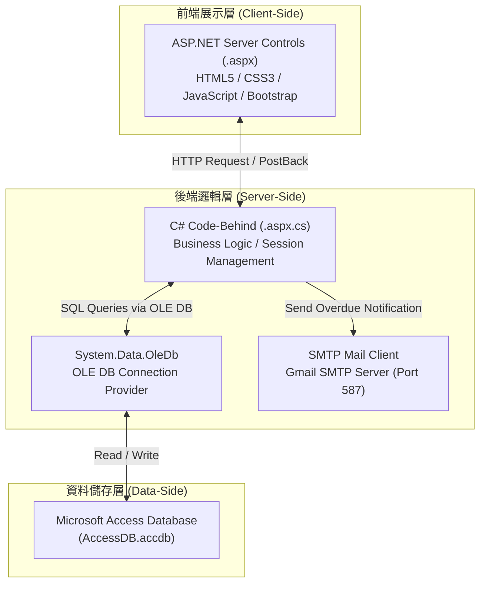
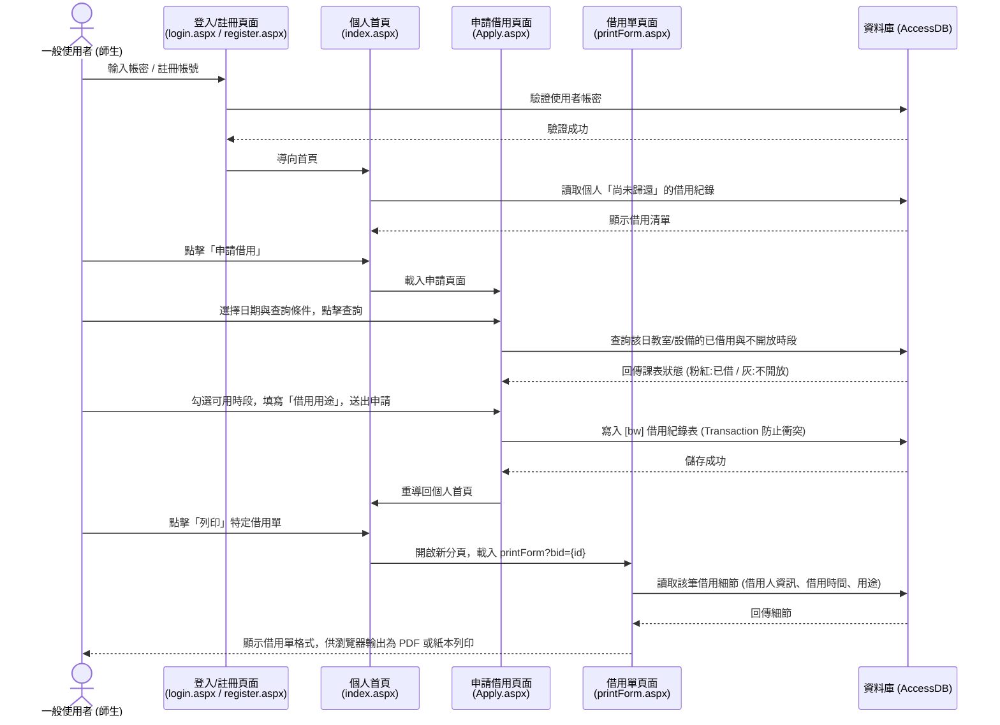
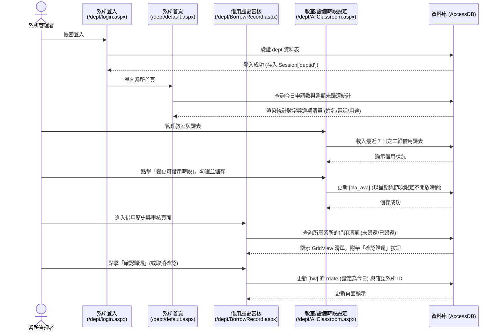
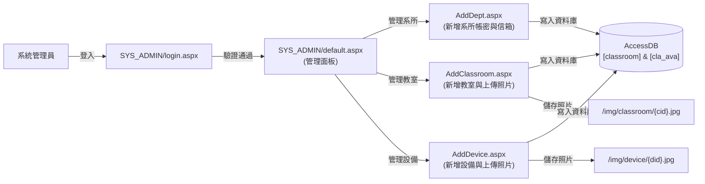
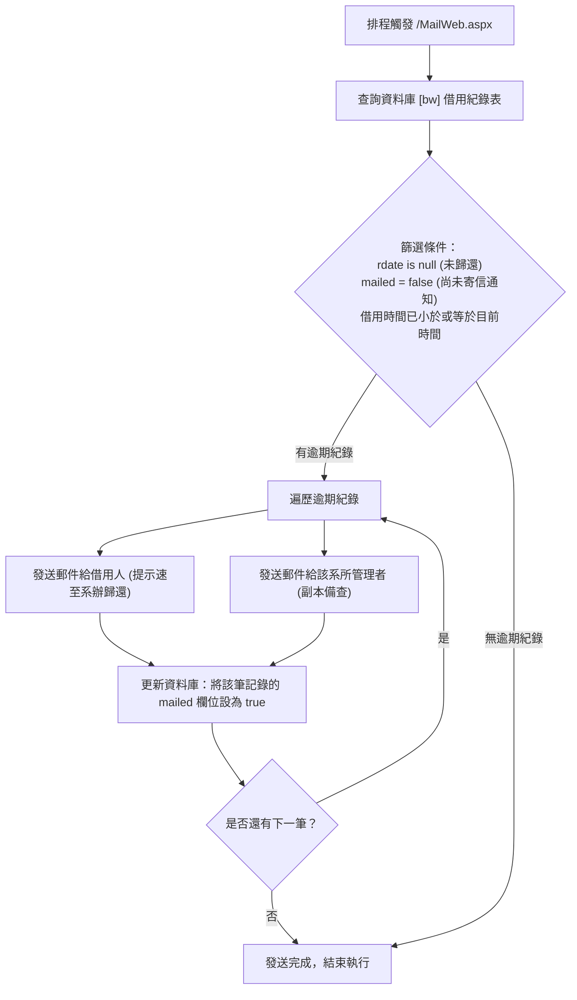

# 中山大學教室與設備借用系統 ─ 系統架構與頁面流程說明文件

本文件詳細說明「中山大學教室與設備借用系統」的系統架構設計、核心模組互動關係，以及各使用者角色的操作頁面流程。

---

## 🏗️ 1. 系統架構圖 (System Architecture)

系統採用傳統的三層式架構 (3-Tier Architecture) 設計，配合 ASP.NET Web Forms 網頁生命週期與 OLE DB 連線至 MS Access 本地資料庫：

---

## 👥 2. 使用者角色與流程 (User Flows)

本系統依權限劃分三個核心操作流程：**一般使用者流程**、**系所管理者流程**、**系統管理員流程**。

### A. 一般使用者流程 (Student / Teacher Flow)

一般師生主要進行教室與設備的**預約申請**與**印出借用單**：

---

### B. 系所管理者流程 (Department Admin Flow)

系所管理員負責審核所屬單位的教室與設備、設定不開放時間，以及確認歸還：

---

### C. 系統管理員流程 (System Admin Flow)

系統管理員擁有最高權限，負責初始化系所、教室與設備資料：

---

## 📧 3. 逾期通知信件排程流程 (Overdue Email Notification)

系統內建逾期通知模組 (`MailWeb.aspx`)，可由伺服器排程工作 (Windows Task Scheduler) 定期觸發：

---

## 📌 4. 關鍵網頁頁面清單 (Page Routing Reference)

| 實體路徑 (URL) | 權限要求 | 頁面用途與說明 |
| :--- | :--- | :--- |
| `/login.aspx` | 無 | 一般使用者登入頁面 |
| `/register.aspx` | 無 | 一般使用者註冊頁面 (寫入 `user` 表) |
| `/index.aspx` | 一般使用者 | 個人首頁，顯示目前借用中的項目與列印借用單按鈕 |
| `/Apply.aspx` | 一般使用者 | 線上借用申請頁面，即時查詢可用時段並送出申請 |
| `/printForm.aspx` | 一般使用者 | 借用單列印版面 (傳入 `bid` 與類型參數) |
| `/MailWeb.aspx` | 伺服器/管理員 | 系統自動發送逾期通知信之觸發端點 |
| `/dept/login.aspx` | 無 | 系所管理員登入頁面 |
| `/dept/default.aspx` | 系所管理者 | 系所儀表板，顯示今日借用動態與逾期清單 |
| `/dept/BorrowRecord.aspx` | 系所管理者 | 系所歷史借用紀錄查詢與歸還審核 (Toggle rdate) |
| `/dept/AllClassroom.aspx` | 系所管理者 | 該系所教室借用狀態二維課表檢視與開放時段修改 |
| `/dept/AllDevice.aspx` | 系所管理者 | 該系所設備借用狀態二維課表檢視與開放時段修改 |
| `/SYS_ADMIN/login.aspx` | 無 | 系統管理員登入頁面 |
| `/SYS_ADMIN/default.aspx` | 系統管理員 | 管理主頁，可查詢/重設使用者與系所管理員之密碼 |
| `/SYS_ADMIN/AddDept.aspx` | 系統管理員 | 新增系所管理員帳號與基本資料 |
| `/SYS_ADMIN/AddClassroom.aspx`| 系統管理員 | 新增教室資料，上傳教室照片並初始化 `cla_ava` 表 |
| `/SYS_ADMIN/AddDevice.aspx` | 系統管理員 | 新增設備資料，上傳設備照片並初始化 `dev_ava` 表 |
